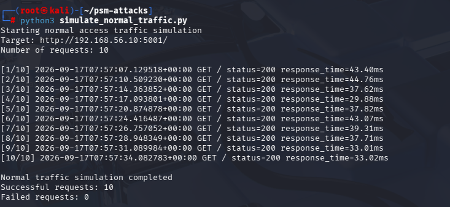
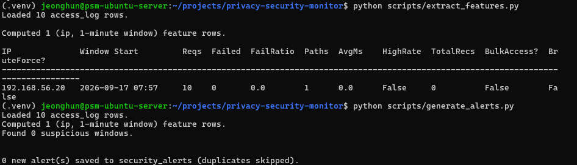
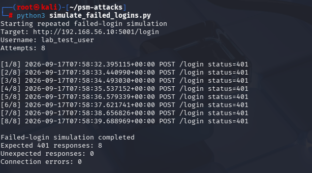
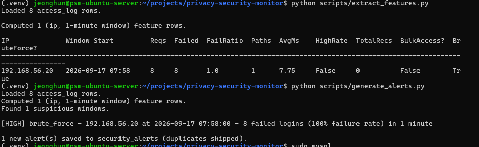
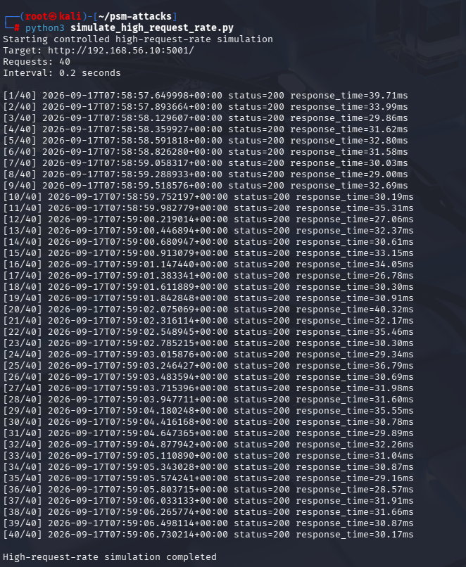
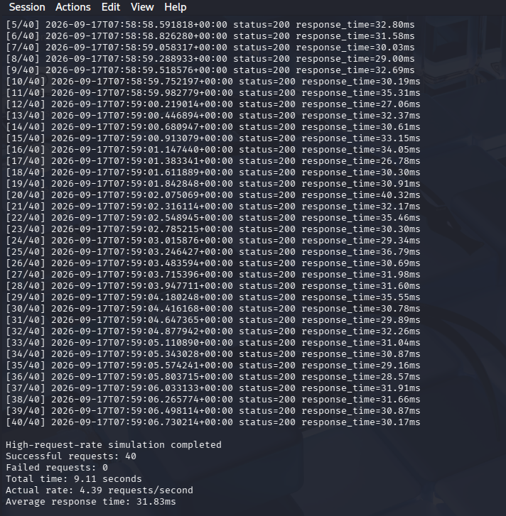
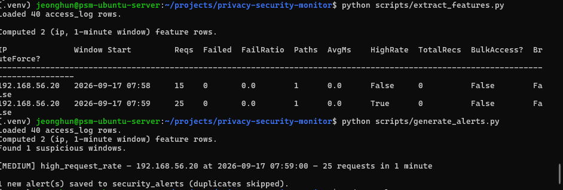
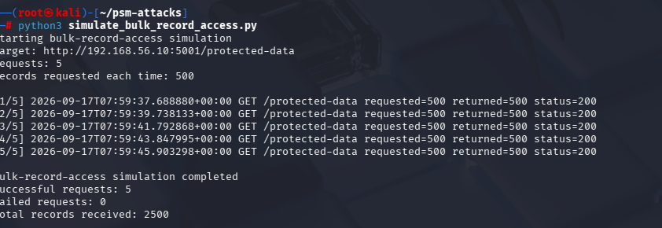
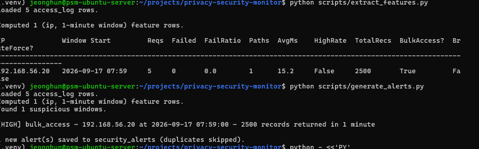
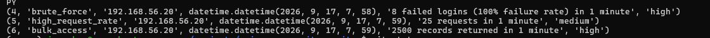

# Security Monitoring & Privacy System

A Linux-based security monitoring and attack detection system that monitors access activity, detects suspicious behaviour, and protects synthetic personal data through data generalisation.

## Project Overview

This project combines security monitoring, attack detection, and privacy-aware data storage in an isolated virtual lab environment.

The Ubuntu VM operates as the main application and monitoring server, while the Kali Linux VM is used to generate controlled security-testing traffic.


## Network Configuration

Each virtual machine uses two network adapters:

* NAT provides outbound Internet access.
* Host-only provides isolated communication between Windows, Ubuntu, and Kali.

| System        | Interface            | IP address         | Purpose           |
| ------------- | -------------------- | ------------------ | ----------------- |
| Windows host  | VirtualBox Host-only | `192.168.56.1/24`  | VM administration |
| Ubuntu Server | `enp0s8`             | `192.168.56.10/24` | Monitoring server |
| Kali Linux    | `eth1`               | `192.168.56.20/24` | Security testing  |
| Ubuntu/Kali   | NAT adapter          | DHCP               | Internet access   |

Ubuntu was configured using Netplan, while Kali was configured using NetworkManager.

## Remote Administration

OpenSSH is enabled on both virtual machines and starts automatically during boot.

Example connections from Windows PowerShell:

```powershell
ssh <ubuntu-user>@192.168.56.10
ssh <kali-user>@192.168.56.20
```


All testing is performed in a controlled virtual lab using synthetic data. Attack simulations must only be conducted against systems owned by or explicitly authorised for this project.


## Synthetic Data
The project uses a synthetically generated dataset containing 5,000 records. 
No real personal information is used.

Each raw record contains the following attributes:
- `record_id`
- `age`
- `postcode`
- `income`
- `occupation`

Income is generated using occupation-specific salary ranges with a weak age dependency to introduce realistic variation while maintaining fully synthetic data. 

The raw dataset is generated using `src/privacy/generate_data.py` and saved in `data/raw/synthetic_users.csv`.

## Data Generalisation

Four attributes were selected as quasi-identifiers: age, postcode, income, and occupation.

These attributes are generalised to reduce the amount of specific information stored in the dataset.

| Attribute | Generalisation | Example |
| --- | --- | --- |
| Age | 10-year age groups | `37` → `30-39` |
| Postcode | Keep the first two digits | `2122` → `21**` |
| Income | $10,000 ranges | `87,000` → `80k-90k` |
| Occupation | Group similar occupations | `Data Analyst` → `Technology` |


## Privacy Analysis

Privacy was evaluated by checking how many records share the same combination of the four generalised quasi-identifiers.


### Record Uniqueness

| Metric | Current | Stronger |
| --- | ---: | ---: |
| Unique records | 25 | 5 |
| Uniqueness rate | 0.50% | 0.10% |
| Records in groups of 5 or more | 4,764 | 4,941 |
| Percentage in groups of 5 or more | 95.28% | 98.82% |

The stronger generalisation reduced the number of unique records from 25 to 5. It also increased the number of records that share their quasi-identifier combination with at least four other records.

### Privacy and Data Utility

Data utility was compared using the number of different categories remaining after generalisation.

| Attribute | Current | Stronger |
| --- | ---: | ---: |
| Age categories | 6 | 3 |
| Postcode categories | 3 | 3 |
| Income categories | 10 | 6 |
| Occupation categories | 6 | 6 |

The stronger generalisation reduced record uniqueness, but it also reduced some of the detail available for analysis.

Age categories decreased from 6 to 3 and income categories decreased from 10 to 6. Postcode and occupation categories remained the same.

This shows the trade-off between privacy and data utility: stronger generalisation can make records harder to distinguish, but it can also reduce the amount of detail available for analysis.
---

## System Architecture

The project uses two isolated virtual machines to separate the monitored system from the traffic-generation environment.

```text
Kali Linux
192.168.56.20
    |
    | HTTP requests
    v
Ubuntu Server
192.168.56.10
    |
    +-- Flask API
    |
    +-- MySQL Database
    |     |
    |     +-- SYNTHETIC_DATA
    |     +-- PROTECTED_DATA
    |     +-- users
    |     +-- access_log
    |     +-- security_alerts
    |
    +-- Feature Extraction
    |
    +-- Attack Detection
```

The Kali Linux VM acts as the controlled traffic-generation host.

The Ubuntu VM hosts the application API, database, access logging, feature extraction, and attack detection components.

The MySQL database is not directly accessed by Kali. Instead, requests are sent to the Flask API, which interacts with the database.

---

## Database Structure

The project uses five main tables.

| Table | Purpose |
| --- | --- |
| `SYNTHETIC_DATA` | Stores the original synthetic dataset |
| `PROTECTED_DATA` | Stores the generalised version of the dataset |
| `users` | Stores application login accounts |
| `access_log` | Records API activity for security monitoring |
| `security_alerts` | Stores generated security alerts |

The API only serves records from `PROTECTED_DATA`.

The original `SYNTHETIC_DATA` table is retained for privacy analysis and comparison and is not exposed through the user-facing API.

---

## API

The Flask API runs on the Ubuntu monitoring server.

The main endpoints are:

| Method | Endpoint | Purpose |
| --- | --- | --- |
| `GET` | `/` | API health check |
| `POST` | `/login` | User authentication and JWT generation |
| `GET` | `/protected-data` | Authenticated access to generalised records |

Every request is recorded in the `access_log` table.

Logged information includes:

- source IP address
- username where available
- action
- HTTP method
- request path
- HTTP status code
- response time
- number of records returned
- timestamp

This information is later used for behaviour-based attack detection.

---

## Security Monitoring

Security monitoring is based on one-minute activity windows for each source IP address.

The feature extraction script calculates:

- total request count
- failed login count
- failed login ratio
- number of distinct API paths
- average response time
- total number of records returned

The current detection rules are:

| Detection | Rule |
| --- | --- |
| Brute-force login | At least 3 failed logins and a failed-login ratio of at least 50% |
| High request rate | At least 20 requests from the same IP within a one-minute window |
| Bulk record access | At least 1,000 records returned to the same IP within a one-minute window |

Detected activity is converted into alerts and stored in the `security_alerts` table.

---

# Running the Project

## 1. Start the Ubuntu Monitoring Server

Move to the project directory:

```bash
cd ~/projects/privacy-security-monitor
```

Activate the Python virtual environment:

```bash
source .venv/bin/activate
```

Check the database connection:

```bash
python src/db/db_connection.py
```

A successful connection should display the available database tables.

Start the Flask API:

```bash
python src/app.py
```

The Ubuntu API should be reachable from the Host-only network at:

```text
http://192.168.56.10:5001
```

The API process should remain running while the tests are performed.

---

## 2. Import the Dataset

If the database tables are empty, import the generated datasets:

```bash
python src/import_data.py
```

The expected result is:

```text
Inserted 5000 rows into SYNTHETIC_DATA.
Inserted 5000 rows into PROTECTED_DATA.
Import completed successfully.
```

A local test account can also be created with:

```bash
python src/create_test_user.py
```

The test account is intended only for the isolated lab environment.

---

## 3. Prepare Kali Linux

On Kali Linux, move to the traffic simulation directory:

```bash
cd ~/psm-attacks
```

The following scripts are used:

```text
simulate_normal_traffic.py
simulate_failed_logins.py
simulate_high_request_rate.py
simulate_bulk_record_access.py
```

Each script targets the Ubuntu server:

```text
192.168.56.10:5001
```

Before testing, confirm that the API is reachable:

```bash
curl http://192.168.56.10:5001/
```

A successful response should contain:

```json
{
  "service": "Security Monitoring & Privacy System API",
  "status": "ok"
}
```

---

# Security Testing

Four traffic scenarios were evaluated.

One represents normal activity, while the remaining three simulate suspicious behaviour.

---

## Test 1 — Normal Traffic

### Kali

Run:

```bash
python3 simulate_normal_traffic.py
```

The script sends 10 low-rate requests to the Ubuntu API.

Observed result:

```text
Successful requests: 10
Failed requests: 0
```


### Ubuntu Analysis

Run:

```bash
python scripts/extract_features.py
```

Observed feature values:

```text
Source IP:    192.168.56.20
Requests:     10
Failed:       0
HighRate:     False
BulkAccess:   False
BruteForce:   False
```

Generate alerts:

```bash
python scripts/generate_alerts.py
```

Result:

```text
Found 0 suspicious windows.
0 new alert(s) saved.
```


### Result

The normal traffic did not generate a security alert.

This demonstrates that the tested normal behaviour was not incorrectly classified as one of the configured attack patterns.

---

## Test 2 — Repeated Failed Login / Brute Force

### Kali

Run:

```bash
python3 simulate_failed_logins.py
```

The script performs eight login attempts using an intentionally incorrect password.

Observed result:

```text
Attempts: 8
Expected 401 responses: 8
Unexpected responses: 0
Connection errors: 0
```


The attack simulation did not successfully authenticate, but it generated behaviour consistent with a brute-force login attempt.

### Ubuntu Analysis

Run:

```bash
python scripts/extract_features.py
```

Observed features:

```text
Source IP:       192.168.56.20
Requests:        8
Failed logins:   8
Failure ratio:   1.0
HighRate:        False
BulkAccess:      False
BruteForce:      True
```

Generate the alert:

```bash
python scripts/generate_alerts.py
```

Observed result:

```text
[HIGH] brute_force
8 failed logins
100% failure rate
```


### Result

The monitoring system correctly detected the repeated failed-login behaviour and generated a HIGH-severity brute-force alert.

---

## Test 3 — High Request Rate

### Kali

Run:

```bash
python3 simulate_high_request_rate.py
```

The test generated:

```text
Requests: 40
Successful requests: 40
Failed requests: 0
Total time: 9.11 seconds
Actual rate: 4.39 requests/second
Average response time: 31.83 ms
```



### Ubuntu Analysis

The activity crossed a one-minute boundary and was therefore divided into two monitoring windows:

```text
07:58 window: 15 requests
07:59 window: 25 requests
```

The second window exceeded the configured threshold of 20 requests.

Observed detection:

```text
Source IP: 192.168.56.20
Requests:  25
HighRate:  True
```

Generated alert:

```text
[MEDIUM] high_request_rate
25 requests in 1 minute
```


### Result

The monitoring system detected the high-rate request activity and generated a MEDIUM-severity alert.

---

## Test 4 — Bulk Record Access

This scenario represents an authenticated client requesting an unusually large amount of protected data within a short period.

The client does not directly access MySQL.

Instead, it retrieves data through the authenticated `/protected-data` API.

### Kali Authentication

A valid JWT must first be obtained from the Ubuntu API and stored in the `API_TOKEN` environment variable.

The token is then used by the bulk-access simulation.

### Kali

Run:

```bash
python3 simulate_bulk_record_access.py
```

The test performs five requests for 500 records each.

Observed result:

```text
Requests: 5
Records requested each time: 500
Successful requests: 5
Failed requests: 0
Total records received: 2500
```


### Ubuntu Analysis

Run:

```bash
python scripts/extract_features.py
```

Observed result:

```text
Source IP:       192.168.56.20
Requests:        5
Total records:   2500
HighRate:        False
BulkAccess:      True
BruteForce:      False
```

Generate the alert:

```bash
python scripts/generate_alerts.py
```

Observed result:

```text
[HIGH] bulk_access
2500 records returned in 1 minute
```


### Result

The monitoring system successfully detected the unusually large volume of data retrieved by the authenticated client and generated a HIGH-severity bulk-access alert.

---

# Security Test Results

The final experiment results were:

| Scenario | Activity | Detection | Severity |
| --- | --- | --- | --- |
| Normal Traffic | 10 normal requests | No suspicious activity | None |
| Failed Login | 8 failed login attempts, 100% failure rate | Brute Force | HIGH |
| High Request Rate | 40 requests generated in 9.11 seconds | High Request Rate | MEDIUM |
| Bulk Record Access | 2,500 protected records retrieved | Bulk Access | HIGH |

### Final Generated Alerts



The final attack alerts were generated from the Kali Linux host:

```text
Attacker IP: 192.168.56.20
```

This confirms that the tests were performed across the isolated Host-only network rather than from localhost on the Ubuntu server.

---

## Detection Pipeline

The complete monitoring process is:

```text
Kali Linux
    |
    | Normal or suspicious HTTP traffic
    v
Ubuntu Flask API
    |
    v
access_log
    |
    v
Feature Extraction
    |
    +-- Request count
    +-- Failed login count
    +-- Failed login ratio
    +-- Records returned
    |
    v
Detection Rules
    |
    +-- Brute Force
    +-- High Request Rate
    +-- Bulk Access
    |
    v
security_alerts
```

---

## Privacy and Security Together

The project combines two related security objectives.

### Privacy Protection

Generalisation reduces the amount of identifying information stored in the protected dataset.

```text
Raw Synthetic Data
        |
        v
Generalisation
        |
        v
Protected Data
```

### Security Monitoring

The API monitors how users interact with the protected dataset.

```text
Client Activity
      |
      v
API
      |
      v
Access Logs
      |
      v
Behaviour Analysis
      |
      v
Security Alerts
```

Together, these components provide both privacy-aware data storage and behavioural security monitoring.

---

# Limitations

The current implementation has several limitations.

### Fixed One-Minute Detection Windows

The monitoring system currently groups events into fixed one-minute windows.

For example, the high-request-rate test started near the end of one minute and continued into the next minute.

The 40 requests were divided into:

```text
15 requests
+
25 requests
```

rather than being analysed as a single group of 40 requests.

The second group still exceeded the detection threshold, but this demonstrates a boundary limitation of fixed-time windows.

A future version could use a rolling or sliding 60-second window to reduce this problem.

### Rule-Based Thresholds

The current detection mechanism uses predefined thresholds.

These thresholds are suitable for the controlled lab environment but would need to be tuned for real production traffic.

### Detection Rather Than Automatic Response

The current system detects suspicious behaviour and records alerts.

It does not currently:

- automatically block attacker IP addresses
- lock accounts after repeated authentication failures
- terminate suspicious sessions
- send real-time administrator notifications

These capabilities could be added as future response mechanisms.

---

# Future Improvements

Potential future improvements include:

- sliding-window attack detection
- automatic temporary IP blocking
- account lockout after repeated failed logins
- API rate limiting
- real-time administrator notifications
- security dashboard and alert visualisation
- additional attack scenarios
- stronger role-based database permissions
- automated experiment execution and reporting

---

# Conclusion

The project demonstrates a combined privacy and security monitoring system in an isolated virtual lab environment.

Synthetic personal data is generalised before being exposed through the application API, reducing the amount of specific identifying information available to clients.

Controlled traffic generated from Kali Linux was used to evaluate the monitoring system.

The system successfully distinguished the tested normal traffic from three suspicious behaviour patterns:

- repeated failed authentication attempts
- high request-rate activity
- bulk access to protected records

Each suspicious scenario was detected from the access logs and converted into a corresponding security alert.

The experiments demonstrate how privacy-preserving data handling and behaviour-based security monitoring can be combined within a single system.
